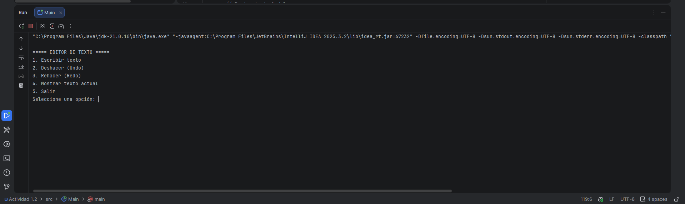
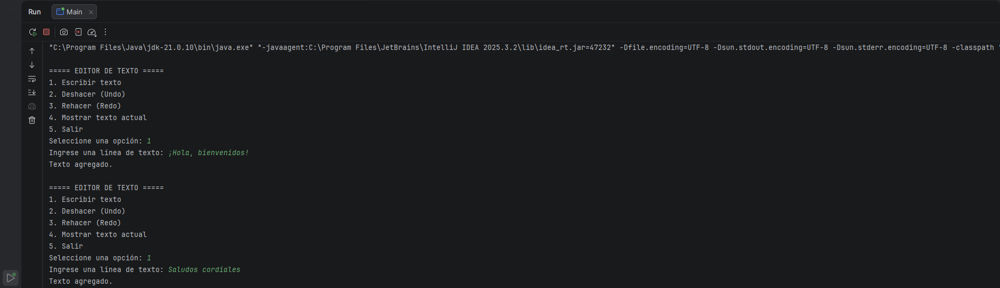
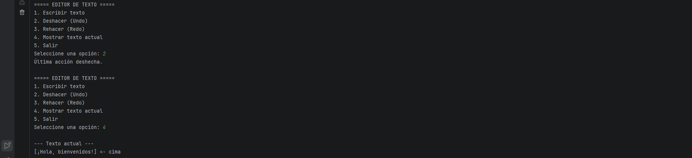
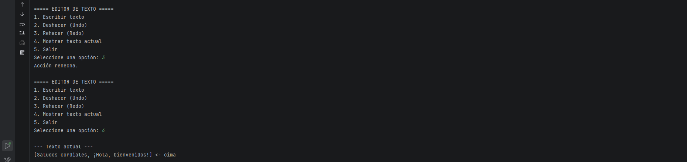

## ACTIVIDAD 1.2
## Simulador de Pilas (Stack) en Java

**Estudiante:** Leyniker Ferley Celis

## 1. Objetivo del proyecto

Comprender el funcionamiento de la estructura de datos **pila (stack)** y aplicarla en un simulador simple de **Deshacer (Undo) y Rehacer (Redo)** en un editor de texto en consola.

Una **pila** funciona bajo el principio **LIFO (Last In, First Out)**, lo que significa que el último elemento que entra es el primero en salir.

Las operaciones principales utilizadas en este proyecto son:

* **push()** → insertar un elemento en la pila
* **pop()** → eliminar el elemento superior
* **peek()** → observar el elemento superior
* **isEmpty()** → verificar si la pila está vacía

El programa utiliza **dos pilas**:

* **Pila principal:** almacena las líneas de texto escritas.
* **Pila secundaria:** almacena las acciones deshechas para permitir rehacerlas.


## 2. Instrucciones de ejecución

1. Abrir el proyecto en **IntelliJ IDEA**.
2. Ubicar el archivo principal del programa:

```
Main.java
```

3. Ejecutar el programa presionando **Run ▶** o haciendo clic derecho sobre el archivo y seleccionando:

```
Run 'Main.main()'
```

4. En la consola aparecerá el menú del editor:

```
1. Escribir texto
2. Deshacer (Undo)
3. Rehacer (Redo)
4. Mostrar texto actual
5. Salir
```

5. Seleccionar la opción deseada ingresando el número correspondiente.


## 3. Estructura del proyecto

La estructura actual del proyecto es la siguiente:

```
ProyectoStack
 ├── src
 │    ├── Main.java
 │    └── Stack.java
 └── README.md
```

* **Main.java:** contiene el menú y la lógica del simulador de texto.
* **Stack.java:** implementa la estructura de datos pila y sus operaciones.


## 4. Capturas de pantalla de la ejecución
### Menú principal del editor de texto


### Escribiendo texto en el editor


### Deshaciendo la última acción


### Rehaciendo la acción deshecha


## 5. Conclusión
Este proyecto ha permitido comprender y aplicar la estructura de datos **pila (stack)** en un contexto práctico, simulando las funciones de **Deshacer (Undo)** y **Rehacer (Redo)** en un editor de texto. A través de la implementación de dos pilas, se ha logrado gestionar eficazmente las acciones del usuario, permitiendo una experiencia interactiva y funcional. Este ejercicio ha reforzado el conocimiento sobre cómo las pilas pueden ser utilizadas para manejar estados y acciones en aplicaciones reales.


